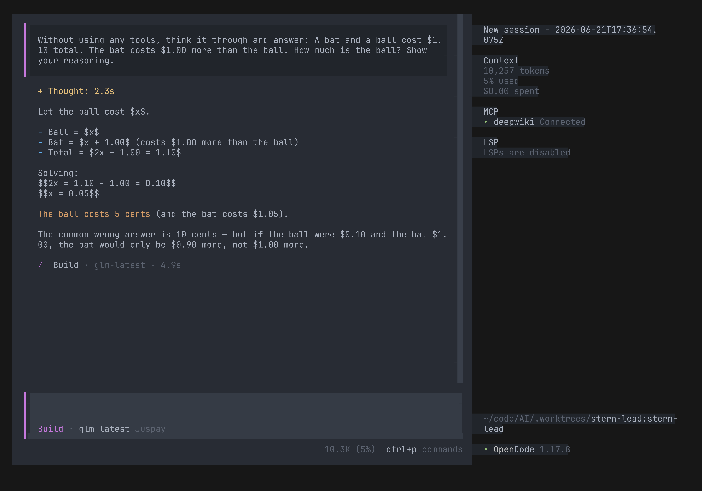

# AI

One-click coding agents with Juspay's LLM configuration.

Currently supports **[OpenCode](https://opencode.ai/)** only. Skills are sourced from:

- [juspay/skills](https://github.com/juspay/skills) — Shared AI agent skills
- [anthropics/skills](https://github.com/anthropics/skills) — `frontend-design` skill

<figure>

<figcaption>OpenCode running in the terminal with Juspay's LLM (<code>just demo</code> to regenerate)</figcaption>
</figure>

## Prerequisites

- **Nix** — Install via [the Nix installer](https://nixos.asia/en/install). New to Nix? See the [Nix First Steps](https://nixos.asia/en/nix-first) tutorial.
- **`JUSPAY_API_KEY`** *(Juspay employees only)* — Create one at [grid.ai.juspay.net/dashboard](https://grid.ai.juspay.net/dashboard) (requires VPN to create, but **not** to use afterwards). Not needed for non-Juspay variants.

## Quick Start

```bash
nix run github:juspay/AI
```

This launches an interactive selector. Or run a specific variant directly:

| Variant | Command | Description |
|---|---|---|
| `opencode-juspay-oneclick` | `nix run github:juspay/AI#opencode-juspay-oneclick` | Juspay config and skills bundled |
| `opencode-oneclick` | `nix run github:juspay/AI#opencode-oneclick` | Skills bundled, bring your own provider (e.g. Claude Max) |
| `opencode-juspay-editable` | `nix run github:juspay/AI#opencode-juspay-editable` | Creates editable Juspay config at `~/.config/opencode/opencode.json` ([customize](https://opencode.ai/docs/config/)) |
| `opencode` | `nix run github:juspay/AI#opencode` | Plain OpenCode, no config |

The `opencode-juspay-*` variants need a `JUSPAY_API_KEY`. If the env var isn't set, the wrapper prompts for it interactively — handy on fresh VMs or containers. Export the var in your shell to skip the prompt on subsequent runs.

### Daily Updates

This flake's `flake.lock` is **auto-updated daily** via CI, so you always get the latest OpenCode release and skills. If pinning via `flake.lock` in your own flake, run `nix flake update AI` to pull the latest.

## Tips

### Web UI

OpenCode can run as a web application in your browser:

```bash
nix run github:juspay/AI#opencode -- web
```

This starts a local server and opens OpenCode in your default browser. Sessions are shared between the web UI and CLI, so you can switch between them seamlessly. You can also specify a port or make it accessible on your network with `--port 4096 --hostname 127.0.0.1`.

See the [OpenCode Web docs](https://opencode.ai/docs/web/) for more.

### GLM thinking mode

The default model, `glm-latest` (GLM-5.2), runs with **maximum reasoning effort**.
OpenCode sends `reasoning_effort: "max"` — the top tier the gateway accepts for this
model — on every request, and renders GLM's reasoning trace in the TUI before each
answer.

<figure>

<figcaption>GLM-5.2 thinking through a problem in OpenCode, with <code>reasoning_effort: max</code></figcaption>
</figure>

This is configured in [`coding-agents/opencode/settings/juspay.nix`](coding-agents/opencode/settings/juspay.nix)
via the model's `reasoningEffort` option. To dial it down, change `"max"` to `"high"`,
`"medium"`, `"low"`, or `"none"`.

## Coding Agent Setup

This repo uses [APM](https://microsoft.github.io/apm/) for coding agent configuration. `.claude/` and `.opencode/` are **vendored** — committed to git and kept in sync by a CI check (`apm-sync` workflow).

```bash
just agent                # launch agent (default: claude)
just agent::apm-vendor    # regenerate vendored .claude/ and .opencode/
just agent::update        # update apm deps to latest, then re-vendor
```

Override the agent with `AI_AGENT`:

```bash
AI_AGENT=opencode just agent
AI_AGENT='claude --dangerously-skip-permissions' just agent
```

## Repo Structure

```
├── .claude/                  # Vendored APM output for Claude Code
├── .opencode/                # Vendored APM output for OpenCode
├── agent/                    # Justfile recipes for apm and agent launch
├── coding-agents/
│   └── opencode/             # OpenCode packages, settings, tests
├── demo/                     # Demo screencast infrastructure
```

Skills are vendored via APM into `.claude/` and `.opencode/` from the sources listed above.

## Related

- [juspay/skills](https://github.com/juspay/skills) — Shared AI agent skills (also usable via [APM](https://microsoft.github.io/apm/))
- [OpenCode Documentation](https://opencode.ai/docs/) — Full docs on usage, configuration, and providers
- [OpenCode GitHub](https://github.com/anomalyco/opencode) — The upstream OpenCode project
- [llm-agents.nix](https://github.com/numtide/llm-agents.nix) — The upstream Nix packaging that this flake builds on
