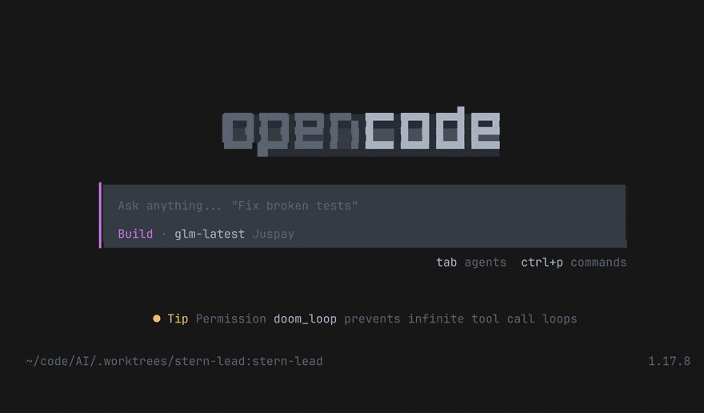

# AI

One-click coding agents with Juspay's LLM configuration.

Supports **[OpenCode](https://opencode.ai/)** and **[pi](https://github.com/badlogic/pi-mono)**. Skills are sourced from:

- [juspay/skills](https://github.com/juspay/skills) — Shared AI agent skills
- [anthropics/skills](https://github.com/anthropics/skills) — `frontend-design` skill

<figure>

<figcaption>OpenCode running in the terminal with Juspay's LLM (<code>just demo</code> to regenerate)</figcaption>
</figure>

## Prerequisites

- **Nix** — Install via [the Nix installer](https://nixos.asia/en/install). New to Nix? See the [Nix First Steps](https://nixos.asia/en/nix-first) tutorial.
- **`JUSPAY_API_KEY`** *(Juspay employees only)* — Create one at [grid.ai.juspay.net/dashboard](https://grid.ai.juspay.net/dashboard) (requires VPN to create, but **not** to use afterwards). Not needed for non-Juspay variants.

## Quick Start

```bash
nix run github:juspay/AI
```

This launches an interactive selector. Or run a specific variant directly:

**OpenCode**

| Variant | Command | Description |
|---|---|---|
| `opencode-juspay-oneclick` | `nix run github:juspay/AI#opencode-juspay-oneclick` | Juspay config and skills bundled |
| `opencode-oneclick` | `nix run github:juspay/AI#opencode-oneclick` | Skills bundled, bring your own provider (e.g. Claude Max) |
| `opencode-juspay-editable` | `nix run github:juspay/AI#opencode-juspay-editable` | Creates editable Juspay config at `~/.config/opencode/opencode.json` ([customize](https://opencode.ai/docs/config/)) |
| `opencode` | `nix run github:juspay/AI#opencode` | Plain OpenCode, no config |

**pi**

| Variant | Command | Description |
|---|---|---|
| `pi-juspay-oneclick` | `nix run github:juspay/AI#pi-juspay-oneclick` | Juspay config and skills bundled |
| `pi-juspay-editable` | `nix run github:juspay/AI#pi-juspay-editable` | Merges Juspay models into `~/.pi/models.json` ([customize](https://github.com/badlogic/pi-mono)) |
| `pi` | `nix run github:juspay/AI#pi` | Plain pi, no config |

The `*-juspay-*` variants need a `JUSPAY_API_KEY`. If the env var isn't set, the wrapper prompts for it interactively — handy on fresh VMs or containers. Export the var in your shell to skip the prompt on subsequent runs.

### Daily Updates

This flake's `flake.lock` is **auto-updated daily** via CI, so you always get the latest OpenCode release and skills. If pinning via `flake.lock` in your own flake, run `nix flake update AI` to pull the latest.

## Home Manager module (config only)

If you manage your environment with [Home Manager](https://nix-community.github.io/home-manager/) and already have an `opencode` binary — from `nixpkgs`, or bundled with another tool — you can install **just the Juspay config**, without a wrapper or a second opencode, via the exposed module:

```nix
# flake inputs
juspay-ai.url = "github:juspay/AI";

# home configuration
{
  imports = [ inputs.juspay-ai.homeModules.opencode ];
  programs.opencode-juspay.enable = true;
}
```

This renders the same `opencode.json` as the packaged variants and writes it to `$XDG_CONFIG_HOME/opencode/opencode.json`. As with the `opencode-juspay-*` variants, the Juspay provider needs `JUSPAY_API_KEY` in the environment at runtime.

| Option | Default | Description |
|---|---|---|
| `programs.opencode-juspay.enable` | `false` | Install the config (no binary). |
| `programs.opencode-juspay.juspay` | `true` | Include the Juspay litellm provider/model settings. Set `false` for the base settings only. |
| `programs.opencode-juspay.settings` | `{}` | Extra opencode settings merged on top. |

The module is system-agnostic — it uses your config's `pkgs`, so it does not pull in this flake's `nixpkgs`.

## Tips

### Web UI

OpenCode can run as a web application in your browser:

```bash
nix run github:juspay/AI#opencode -- web
```

This starts a local server and opens OpenCode in your default browser. Sessions are shared between the web UI and CLI, so you can switch between them seamlessly. You can also specify a port or make it accessible on your network with `--port 4096 --hostname 127.0.0.1`.

See the [OpenCode Web docs](https://opencode.ai/docs/web/) for more.

### GLM reasoning-effort tiers

`glm-latest` (GLM-5.2) reasons by default. To trade thinking depth for speed, the
model picker (`ctrl+x m`) exposes the same model at several reasoning-effort tiers —
GLM-5.2 collapses low/medium into "high", so these are the only distinct levels:

| Picker entry | `reasoning_effort` | Use it for |
|---|---|---|
| `glm-latest` | *(gateway default)* | the default — thinking on |
| `glm-max`    | `max`  | deepest reasoning |
| `glm-high`   | `high` | strong reasoning, faster |
| `glm-fast`   | `none` | no thinking, fastest replies |

<figure>

<figcaption>Picking a GLM reasoning-effort tier in OpenCode (<code>ctrl+x m</code>)</figcaption>
</figure>

The tiers are defined in [`coding-agents/opencode/settings/juspay.nix`](coding-agents/opencode/settings/juspay.nix);
all target the same gateway model (`glm-latest`) and differ only in `reasoningEffort`.

### pi and the LiteLLM gateway

pi (badlogic/pi-mono) supports arbitrary OpenAI-compatible endpoints via its
`~/.pi/agent/models.json`. The `pi-juspay-*` variants generate this file from
the same shared catalog as the OpenCode config, keeping model ids and limits
in sync between the two agents.

To use a model with pi:

```bash
# Interactive (prompts for JUSPAY_API_KEY if not set)
nix run github:juspay/AI#pi-juspay-oneclick -- --model litellm/kimi-k3

# With API key already exported: oneclick keeps pi's state off ~/.pi; the
# editable variant instead merges Juspay into your existing ~/.pi/models.json
nix run github:juspay/AI#pi-juspay-editable -- --model litellm/glm-latest
```

You can also select a reasoning-effort tier per session with pi's thinking
suffix, e.g. `--model litellm/glm-latest:max` or `--model litellm/glm-latest,low,med,high`.

## Coding Agent Setup

This repo uses [APM](https://microsoft.github.io/apm/) for coding agent configuration. `.claude/` and `.opencode/` are **vendored** — committed to git and kept in sync by a CI check (`apm-sync` workflow).

```bash
just agent                # launch agent (default: claude)
just agent::apm-vendor    # regenerate vendored .claude/ and .opencode/
just agent::update        # update apm deps to latest, then re-vendor
```

Override the agent with `AI_AGENT`:

```bash
AI_AGENT=opencode just agent
AI_AGENT='claude --dangerously-skip-permissions' just agent
```

## Repo Structure

```
├── .claude/                  # Vendored APM output for Claude Code
├── .opencode/                # Vendored APM output for OpenCode
├── agent/                    # Justfile recipes for apm and agent launch
├── coding-agents/
│   ├── catalog.nix           # Shared Juspay model catalog (opencode, pi)
│   ├── opencode/             # OpenCode packages, settings, home-module, tests
│   └── pi/                   # pi packages and models.json generation
├── demo/                     # Demo screencast infrastructure
```

Skills are vendored via APM into `.claude/` and `.opencode/` from the sources listed above.

## Related

- [juspay/skills](https://github.com/juspay/skills) — Shared AI agent skills (also usable via [APM](https://microsoft.github.io/apm/))
- [OpenCode Documentation](https://opencode.ai/docs/) — Full docs on usage, configuration, and providers
- [OpenCode GitHub](https://github.com/anomalyco/opencode) — The upstream OpenCode project
- [llm-agents.nix](https://github.com/numtide/llm-agents.nix) — The upstream Nix packaging that this flake builds on
